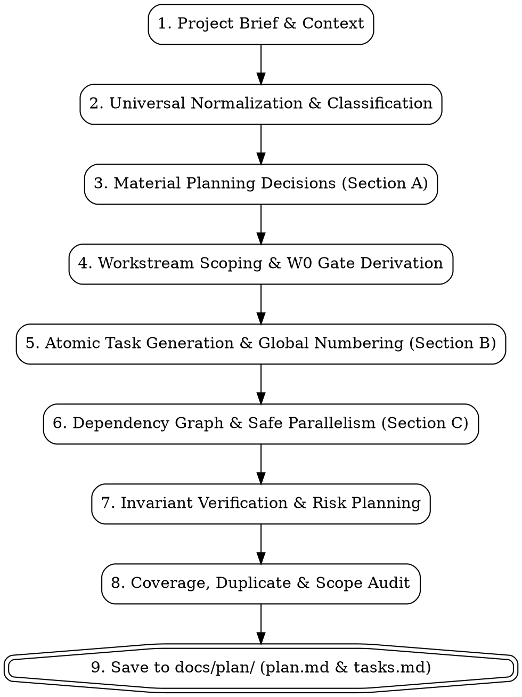

# Building Project Plans

## Overview

Convert any project brief into a complete, implementation-ready delivery plan: **Planning Decisions → Task Inventory → Sequencing**.

The skill is strictly **project-agnostic**. It adapts to the project rather than forcing the project into a preconceived technical stack or boilerplate workstream pattern.

> [!IMPORTANT]
> **Strict Planning-Only Boundary**: This skill produces the **plan only**.
> No project implementation occurs while this skill is active. Do not write production code, modify databases, provision infrastructure, run migrations, or alter workspace files. The terminal state is an **implementation-ready plan** saved to `docs/plan/`.

---

## When to Use

Use this skill when:
- Taking a project, system proposal, RFC, or initiative from concept to executable tasks.
- Decomposing greenfield software, existing codebase modifications, cloud migrations, database re-architectures, data/AI pipelines, infrastructure rollouts, or multi-system programs.
- Creating an engineering delivery plan for humans, agent teams, or project management systems.
- You need clear workstreams, explicit dependencies, blocking gates, and safe parallel paths before touching code.

**When NOT to use:**
- Trivial, single-file bug fixes or simple code tweaks.
- Pure investigatory questions ("how does X work in this repo?").
- Actively implementing tasks from an already approved plan.

---

## Foundational Principles

1. **Planning-First**: Upstream decisions govern downstream work. Never generate tasks before understanding project context and resolving material decisions.
2. **Project-Agnostic Adaptation**: Never assume a web application, relational database, frontend/backend split, or cloud deployment unless explicitly required by the brief.
3. **Existing-Project Preservation**: For existing repositories, inspect conventions and active interfaces first. Extend established patterns; do not invent new architecture unless requested.
4. **Atomic Verifiable Units**: One task = one independently verifiable delivery unit. Every task must produce a concrete deliverable and specify verification.
5. **Continuous Global Numbering**: Task numbers are continuous integers (`1..N`) across the entire plan. Never reset numbering per workstream.
6. **Invariants Protected by Verification**: Critical system invariants must be protected by verification tasks placed alongside the work, not dumped into the end of the project.
7. **Scope Protection**: Never silently expand scope. Desirable but unrequested additions are classified as out-of-scope or optional enhancements.
8. **Violating Letter is Violating Spirit**: Skipping steps, coding prematurely, or generating vague task titles violates the core discipline of delivery planning.

---

## Canonical Output Structure & Persistence

Every generated plan strictly follows this structure (see [plan-output-contract.md](references/plan-output-contract.md) for full details) and is persisted to the target project's `docs/plan/` directory:

```text
<Project Root>/
└── docs/
    └── plan/
        ├── plan.md       # Complete Delivery Plan (Overview, Section A Decisions, Section C Sequencing)
        └── tasks.md      # Actionable Task Inventory (Section B: W0...Wn, Tasks 1..N with acceptance criteria)
```

### Complete Delivery Plan (`docs/plan/plan.md`)
```text
<Project Name> — Complete Delivery Plan

A. Planning / Architecture Decisions
   [Material decisions: Context, Options, Selected Direction, Reason, Invariants, Affected Workstreams, Must Resolve Before, Risk if Deferred]

B. Task Inventory Summary
   [Summary overview of workstreams W0...Wn with link to tasks.md]

C. Sequencing
   [Explicit gates, parallel execution branches (e.g. W1 → (W2 ∥ W3) → W4), and critical path explanation]

Optional: PM Proposals
   [Normalized proposals for Jira, Linear, GitHub Issues, etc.]
```

### Task Inventory (`docs/plan/tasks.md`)
```text
<Project Name> — Task Inventory

W0 — [Discovery / Architecture / Contract Gate, if necessary]
W1 — [First Delivery Workstream]
W2 — [Second Delivery Workstream]
...
Wn — [Hardening, Cross-Domain Regression & Release Readiness]
[Tasks 1..N with continuous numbering, action verbs, deliverables, acceptance criteria, and verification]
```

---

## Step-by-Step Planning Methodology



### Step 1: Normalize & Classify Project Brief
Extract available project facts using the schema in [project-normalization.md](references/project-normalization.md):
- Identify `PROJECT_TYPE` (Greenfield, Migration, Integration, Refactor, Infrastructure, Data/AI).
- Extract `CURRENT_STATE` vs. `TARGET_STATE`, `IN_SCOPE`, `OUT_OF_SCOPE`, and `CRITICAL_INVARIANTS`.
- Classify unknowns: `BLOCKING` (becomes a gate), `DECISION_REQUIRED` (Section A), or `SAFE_ASSUMPTION` (documented).
- Detect contradictions immediately and elevate them to Section A.

### Step 2: Identify Material Planning Decisions (Section A)
Identify choices that materially impact architecture, data models, interfaces, security, migration, delivery order, or operability.
- If existing architecture already settles the choice, preserve it.
- Each decision must document: Context, Options, Selected Direction, Reason, Invariants, Affected Workstreams, Must Resolve Before, and Risk if Deferred.

### Step 3: Scope Workstreams & W0 Gate
- Group delivery into cohesive, bounded domains derived from the project (not generic templates).
- Create `W0` (e.g., `W0 — Specification & Architecture`) **only** when downstream work genuinely requires an upfront discovery or design gate.
- Scale appropriately: small projects use 2-3 workstreams; large programs partition by subsystem.

### Step 4: Generate Atomic Tasks with Global Numbering (Section B)
Follow the contract in [task-contract.md](references/task-contract.md):
- Maintain globally continuous numbering: `1, 2, 3... N` across all workstreams.
- Start titles with action verbs (`Define`, `Implement`, `Migrate`, `Configure`, `Verify`).
- Ensure each task represents one independently verifiable deliverable unit. Split oversized tasks; merge trivial file edits.
- Assign priorities: `P0` (blocker/correctness/safety), `P1` (core requirement), `P2` (supporting), `P3` (polish/enhancement).

### Step 5: Build Dependency Graph & Parallelization Strategy (Section C)
- Identify real hard dependencies, soft dependencies, gate dependencies, and external dependencies.
- Map parallel-safe execution branches: `W1 → (W2 ∥ W3) → W4`.
- Validate that task numbering alone does not dictate dependency. Verify there are no circular dependencies.

### Step 6: Pair Verification with Implementation
- Every critical invariant must have explicit verification.
- Place domain unit, integration, or contract verification directly in the workstream alongside the code it protects.
- Reserve the final workstream (`Wn`) for cross-domain regression, load/soak testing, security auditing, and release rehearsals.

### Step 7: Audit Plan Coverage & Eliminate Residue
- **Traceability**: Verify every in-scope requirement maps to a task, and every task has a justified reason to exist.
- **Duplicates**: Eliminate exact or semantic duplicates across workstreams.
- **Scope Audit**: Remove unrequested features or unnecessary redesigns.

### Step 8: Persist Plan & Tasks to `/docs/plan/`
Save the generated deliverables directly into the target project's `/docs/plan/` directory:
- **`docs/plan/plan.md`**: Contains the strategic delivery blueprint (Project Overview, Section A Decisions, Section C Sequencing, and optional PM proposals).
- **`docs/plan/tasks.md`**: Contains the tactical task inventory (Section B: W0...Wn with globally numbered tasks 1..N, acceptance criteria, deliverables, and verification commands).
- Create `/docs/plan/` if it does not already exist. The skill stops once these files are written.

---

## Bulletproofing Against Rationalizations

Consult [pressure-scenarios.md](references/pressure-scenarios.md) for full scenario walkthroughs and test cases.

| Rationalization / Temptation | Binding Reality |
|---|---|
| *"It's an urgent emergency; I'll start coding immediately without a plan."* | **Forbidden.** Emergency code without planning creates outages. Formulate a 2-minute minimal plan (Tasks 1..4) with critical safety invariants first. The skill never implements code. |
| *"I'll jump straight to the task list and skip Section A."* | **Forbidden.** Tasks cannot be defined for unmade architectural choices. Upstream decisions govern deliverables. Section A always precedes Section B. |
| *"Every project needs Database, Backend, and Frontend workstreams."* | **False.** CLI tools, compilers, data pipelines, and infrastructure have distinct architectures. Workstreams must match the project domain. |
| *"I will reset task numbers to 1 in each workstream."* | **Forbidden.** Task IDs must be globally continuous (1..N). Resetting IDs causes broken dependency tracking. |
| *"I'll defer all testing to a single workstream at the very end."* | **Forbidden.** Domain verification must live alongside the implementation task it validates to catch errors early. |
| *"I'll add extra features or refactor untouched code to make it better."* | **Forbidden.** Scope protection rule: do not silently expand scope. Mark suggestions as optional or out-of-scope. |
| *"The existing repository structure is old, so I'll redesign it."* | **Forbidden.** Extend established conventions and active interfaces. Existing code is context, not a blank slate. |

---

## Red Flags — Stop and Correct Immediately

If any of these conditions occur, STOP immediately and fix:
- 🚩 Writing production code, modifying databases, or executing shell implementations while running this skill.
- 🚩 Outputting tasks before decisions.
- 🚩 Forcing a database/backend/frontend workstream onto a non-web project.
- 🚩 Task numbering resetting per workstream (`W0: 1, 2; W1: 1, 2`).
- 🚩 Vague task titles like "Backend work", "Security stuff", or "Testing".
- 🚩 Critical migrations or business rules with zero verification tasks.
- 🚩 Unrequested scope additions silently introduced into the plan.
- 🚩 Failing to persist the plan and tasks to `docs/plan/plan.md` and `docs/plan/tasks.md`.

---

## Quick Reference

- **File Destination**: Persisted to `docs/plan/plan.md` (Blueprint & Decisions) and `docs/plan/tasks.md` (Task Inventory).
- **Output Order**: `Section A (Decisions)` → `Section B (Task Inventory W0...Wn)` → `Section C (Sequencing)` → `Optional PM Proposals`.
- **Task Titles**: `[Action Verb] [Concrete Deliverable]` (e.g., `Implement BLAKE3 streaming file hasher`).
- **Priority**: `P0` (Blocker / Integrity / Security), `P1` (Core Requirement), `P2` (Supporting), `P3` (Polish).
- **Dependencies**: Explicit IDs only (e.g., `Depends on Tasks 2, 4`).
- **Reference Examples**: See [examples.md](references/examples.md) for full verified sample plans.
